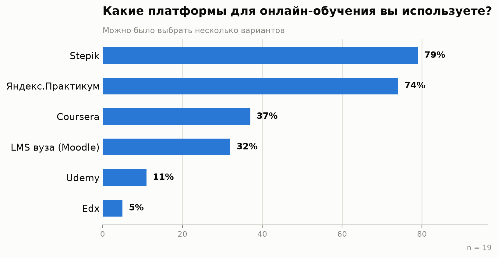

# Анализ конкурентов

Источники: сайты сервисов, поисковая выдача и обзоры (сентябрь 2026), similarweb.com — для оценки трафика (данные similarweb ограничены бесплатным тарифом, для части сайтов недоступны — отмечено ниже).

## 1. Список конкурентов

| Сервис | Тип | Охват | Прямой/косвенный |
|---|---|---|---|
| [Coursera](https://www.coursera.org) | Массовая платформа курсов от вузов и компаний, специализации, сертификаты | Глобальный | **Прямой, ключевой** |
| [edX / Open edX](https://www.edx.org) | Платформа курсов от университетов; Open edX — open-source движок, на котором построены Coursera и edX | Глобальный | **Прямой, ключевой** |
| [Stepik](https://stepik.org) | Массовая платформа курсов, сильна в СНГ, каталог + конструктор курсов | Региональный (СНГ) | **Прямой, ключевой** |
| [«Открытое образование»](https://openedu.ru) | Курсы ведущих российских вузов на движке Open edX | Региональный | Прямой |
| [Яндекс.Практикум](https://practicum.yandex.ru) | Онлайн-курсы с менторами, преимущественно ИТ-профессии | Региональный | Прямой |
| [Udemy](https://www.udemy.com) | Маркетплейс курсов от независимых авторов | Глобальный | Прямой |
| Moodle (LMS вузов, в т.ч. БГУ) | Институциональная LMS для внутренних курсов вуза | Локальный (внутри вуза) | Косвенный (закрытая система, не публичный каталог) |
| [Хекслет](https://ru.hexlet.io) | Специализированная платформа для практических ИТ-курсов | Региональный | Косвенный (узкая ниша) |
| YouTube-каналы и бесплатные плейлисты | Неструктурированное обучение по видео | Глобальный | Косвенный (субститут) |

Фактическое использование платформ целевой аудиторией (по данным опроса, [03-survey.md](03-survey.md)):

## 2. Ценовая составляющая

Модель монетизации в отрасли смешанная: бесплатный доступ к материалам + платный сертификат/проверка заданий (Coursera, edX, «Открытое образование»), либо разовая покупка курса (Udemy, Stepik — курсы от авторов), либо подписка (Яндекс.Практикум — курсы с оплатой по месяцам/полная стоимость программы). Для учебного прототипа EduPath закладывается модель «бесплатный доступ к материалам курса + сертификат по итогам прохождения» — по аналогии с Coursera/edX/«Открытым образованием», как наиболее располагающая к пробному использованию без барьера входа.

## 3. Объём трафика и динамика

Точные цифры трафика для конкретных региональных LMS (Stepik, «Открытое образование») оценены по косвенным ориентирам из открытых источников:
- **Coursera и edX/Open edX** — крупнейшие по охвату и количеству курсов, признанный отраслевой стандарт, на движке Open edX построены обе платформы.
- **Stepik** — по отраслевым обзорам называется одной из наиболее заметных платформ на рынке СНГ, в том числе как замена ушедшим с рынка сервисам.
- **Яндекс.Практикум, GeekBrains, Skillbox** (упоминаются в обзорах как топ LMS 2026 года) — сильны в сегменте платных профессиональных курсов с менторской поддержкой.

## 4. Региональная популярность платформ

- **Coursera, edX, Udemy** — глобальные платформы, англоязычный контент преобладает, используются международной аудиторией.
- **Stepik, «Открытое образование», Яндекс.Практикум** — популярны в русскоязычном сегменте (СНГ), в том числе как локализованная альтернатива ушедшим с рынка сервисам.
- **Moodle-инсталляции вузов** — используются только студентами и преподавателями конкретного учебного заведения, не являются публичным каталогом.

## 5. Рейтинг каналов привлечения трафика (оценочно, по типу сервиса)

1. **Партнёрства с вузами и компаниями** — основной канал у Coursera, edX, «Открытого образования»: курсы публикуют сами университеты, что приводит их аудиторию.
2. **SEO и контент-маркетинг** — Stepik, Яндекс.Практикум активно продвигаются через статьи, гайды, бесплатные вводные курсы.
3. **Реферальные программы и сертификаты как повод поделиться** — пользователи публикуют полученные сертификаты в LinkedIn/соцсетях, приводя новых пользователей.
4. **Прямые переходы от учебных заведений** — Moodle и подобные закрытые LMS получают трафик исключительно по прямым ссылкам от вуза, без внешнего продвижения.

## 6. Потребительский портрет клиентов конкурентов

- **Coursera/edX:** студенты и специалисты 20-40 лет, часто с целью повышения квалификации или получения официального сертификата вуза; готовы платить за подтверждение результата.
- **Stepik/«Открытое образование»:** русскоязычная аудитория, включая студентов вузов, которым преподаватель назначил курс как часть учебной программы — то есть часть аудитории приходит не по своей инициативе, а по требованию учебного заведения.
- **Udemy:** широкая аудитория с разным уровнем мотивации, часто покупает курсы по акции «про запас», не всегда проходит до конца.
- **Moodle вуза:** обязательная аудитория — студенты и преподаватели конкретного вуза, мотивация смешанная (часть — учебная необходимость, часть — реальный интерес).

## 7. Выводы для проектирования

1. Ключевое отличие успешных платформ (Coursera, edX, Stepik) — единая система, где материалы, проверка знаний и общение находятся в одном месте, а не разрознены — это подтверждает актуальность выбранной темы.
2. Слабое место закрытых вузовских LMS (Moodle) — отсутствие мотивационных механик (прогресс, сертификаты, геймификация) — ниша для дифференциации EduPath, **подтверждённая опросом** ([03-survey.md](03-survey.md)): 58% отмечают нехватку мотивации как главную сложность, 84% назвали бы это причиной бросить курс.
3. Наличие гостевого доступа к каталогу (просмотр без регистрации) — стандарт отрасли (Coursera, edX, Stepik), обязательный элемент для EduPath.
4. **Скорректировано опросом:** для целевой аудитории (студенты технического вуза) **Stepik (79%) и Яндекс.Практикум (74%) используются значительно чаще Coursera (37%)** — локальные/региональные игроки на практике более прямые конкуренты для этого сегмента, чем глобальный Coursera, несмотря на его больший общий охват по данным раздела 3.
5. Мобильный офлайн-доступ к материалам — не у всех платформ реализован одинаково хорошо, но по опросу это не главный приоритет пользователя (умеренный спрос — 42%); отложен как второстепенная, а не ключевая функция мобильного приложения (см. [01-task.md](01-task.md)).
