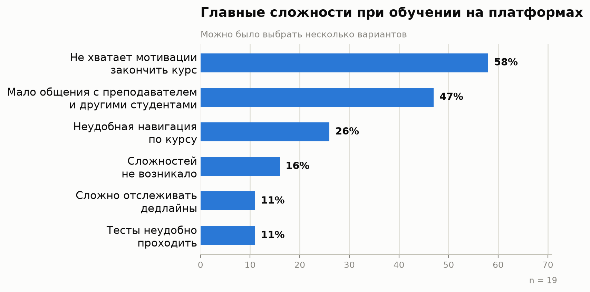
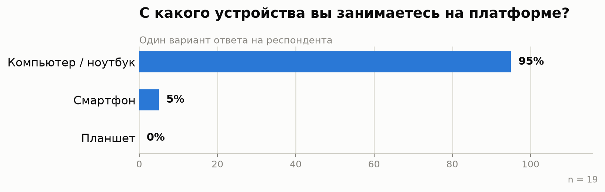
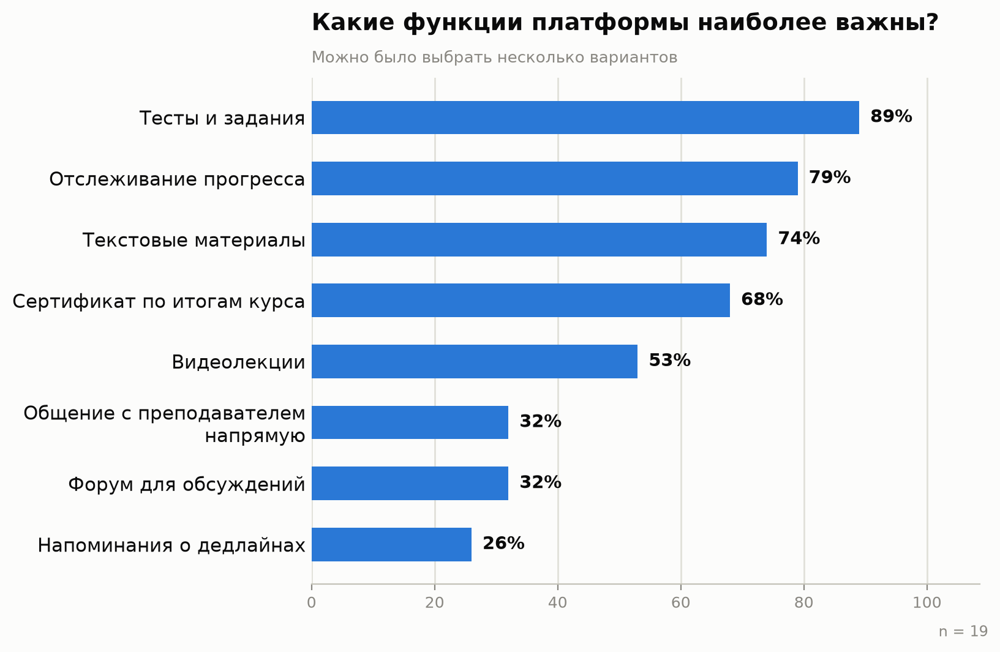
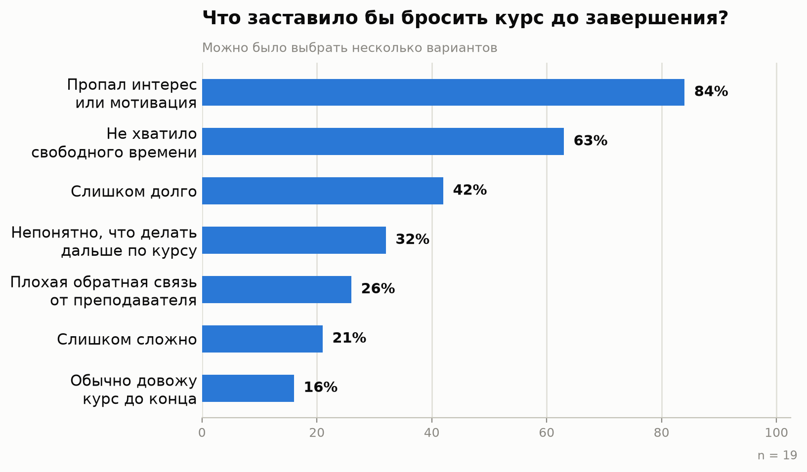
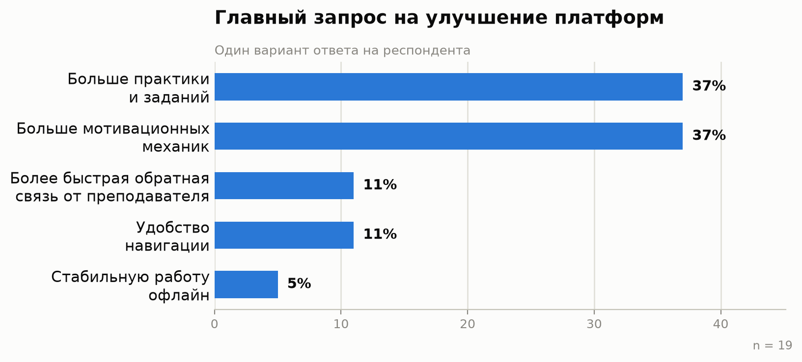

# Опрос потенциальных пользователей

Инструмент: Google Forms. Опросник разослан знакомым командой (целевая аудитория — студенты, учащиеся и преподаватели, имеющие опыт или интерес к онлайн-обучению).

Полный текст опросника — см. [oprosnik.md](oprosnik.md).

## Структура опросника

1. **Блок 1. О вас** — пол, возраст, роль (студент/преподаватель/оба/ни то ни другое), сфера деятельности.
2. **Блок 2. Текущий опыт с онлайн-обучением** — какими платформами пользовались, для чего, сложности, доля курсов, пройденных до конца.
3. **Блок 3. Технические навыки и среда** — устройство, ОС, уверенность пользования, место занятий, офлайн-доступ.
4. **Блок 4. Ожидания от платформы** — важные функции для студента и отдельно для преподавателя, уведомления, причины бросить курс.
5. **Блок 5. Итоговая оценка** — главный запрос на улучшение существующих платформ.

Все вопросы опросника закрытые (одиночный/множественный выбор из вариантов) — это упрощает последующую количественную обработку ответов.

## Результаты опроса

**Собрано 19 ответов** (19 сентября 2026) от студентов ФПМИ 18-25 лет. Данные обработаны, ниже — сводка по каждому вопросу.

### Блок 1. О вас
- Пол: 11/19 (58%) мужской, 8/19 (42%) женский.
- Возраст: **19/19 (100%)** — 18-25 лет.
- Роль: **19/19 (100%)** — студент/учащийся.
- Сфера: 18/19 (95%) IT/инженерия, 1/19 (5%) экономика и бизнес.

### Блок 2. Опыт с онлайн-обучением
- Частота использования платформ: 15/19 (79%) — иногда, 2/19 (11%) — регулярно, 2/19 (11%) — пробовали один раз. Никто не ответил «никогда».

- Цель использования: самообразование — 18/19 (95%), учёба в вузе (обязательные курсы) — 16/19 (84%), повышение квалификации — 3/19 (16%). Большинство использует платформы одновременно и для учёбы, и для самообразования.

- Доходят до конца курса: почти всегда — 3/19 (16%), иногда — 13/19 (68%), редко — 2/19 (11%), никогда — 1/19 (5%). 84% не проходят курсы стабильно до конца.

### Блок 3. Технические навыки и среда

- ОС: Windows — 10/19 (53%), macOS — 5/19 (26%), Linux — 4/19 (21%).
- Уверенность: уверенно — 15/19 (79%), средне — 4/19 (21%), с трудом — 0.
- Место занятий: дома — 16/19 (84%), в разных местах — 3/19 (16%).
- Офлайн-доступ: не пользуются — 11/19 (58%), да часто — 5/19 (26%), иногда — 3/19 (16%).

### Блок 4. Ожидания от платформы

- Уведомления о новых материалах/дедлайнах/ответах: да — 16/19 (84%), не важно — 3/19 (16%).

### Блок 5. Итоговая оценка

## Ключевые выводы из опроса

1. **Мотивация — главная проблема, не техника.** Топ-1 сложность (58%) и топ-1 причина бросить курс (84%) — потеря мотивации, а не неудобство интерфейса. Это подтверждает приоритет мотивационных механик (прогресс, сертификат) в [стратегии дизайна](07-strategy.md) и меняет расстановку приоритетов функциональности в [01-task.md](01-task.md).
2. **Desktop, а не мобильный — основное устройство для обучения** (95% против 5% смартфон). Это расходится с изначальным предположением о «мобильном сценарии на ходу» — роль мобильного приложения нужно сместить в сторону уведомлений, чтения текста и лёгкого повторения материала, а не полноценного прохождения видео/тестов. Требования к мобильному прототипу в [01-task.md](01-task.md) скорректированы.
3. **Тесты/задания и прогресс важнее видео.** Видеолекции — только на 5 месте по важности (53%), тогда как тесты (89%) и прогресс (79%) — в топе. Стоит не переоценивать видео-контент как основную ценность на старте прототипа.
4. **Раздельные профили «самомотивированный» / «по программе» на практике смешаны**: 95% используют платформу и для самообразования, и одновременно 84% — по требованию вуза. В [04-profiles.md](04-profiles.md) это уточнено — деление сохранено как полезная модель крайних случаев, но большинство пользователей — гибрид.
5. **Локальные конкуренты сильнее глобальных для этой аудитории**: Stepik (79%) и Яндекс.Практикум (74%) используются значительно чаще Coursera (37%) — обновлено в [02-competitors.md](02-competitors.md).
