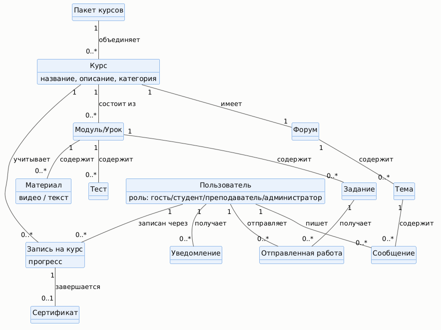

# Анализ задач и ролей. Объектная модель

## 1. Матрица «задача — роль пользователя»

| Составляющие процесса обучения | Гость | Студент | Преподаватель | Администратор |
|---|:---:|:---:|:---:|:---:|
| Регистрация | | + | + | |
| Просмотр каталога курсов | + | + | + | + |
| Просмотр описания курса (программа, автор) | + | + | + | + |
| Запись на курс | | + | | |
| Просмотр видео/текстовых материалов | | + | + | |
| Прохождение теста | | + | | |
| Отправка письменного задания | | + | | |
| Проверка присланных заданий | | | + | |
| Создание/редактирование курса и модулей | | | + | |
| Загрузка материалов в курс | | | + | |
| Создание тестов и заданий | | | + | |
| Участие в форуме курса | | + | + | |
| Модерация сообщений форума | | | + | + |
| Отслеживание собственного прогресса | | + | | |
| Просмотр статистики по студентам курса | | | + | |
| Получение сертификата | | + | | |
| Модерация/публикация нового курса в каталоге | | | | + |
| Управление категориями каталога | | | | + |
| Управление пользователями (роли, блокировка) | | | | + |
| Формирование отчётности по платформе | | | | + |

**Задачи, реализуемые в первую очередь** (пересечение высокой частоты и критичности для основного сценария): просмотр каталога и описания курса, запись на курс, просмотр материалов, прохождение теста — это ядро MVP.

## 2. Объектная модель

Схема связей между объектами продукта:

| Объект | Мощность | Представления | Действия | Атрибуты |
|---|---|---|---|---|
| **Курс** | Сотни | список/каталог, карточка, детальное | искать, просмотреть, создать, редактировать, опубликовать/снять с публикации | название, описание, категория, уровень сложности, автор, рейтинг, длительность |
| **Пакет курсов (специализация)** | Десятки | список, карточка | просмотреть, создать, редактировать | название, входящие курсы, порядок прохождения |
| **Модуль/Урок** | Тысячи | список внутри курса | просмотреть, добавить, редактировать, удалить, изменить порядок | название, порядковый номер, тип (видео/текст/тест/задание) |
| **Материал** (видео/текст) | Тысячи | плеер/просмотр текста | просмотреть, скачать (офлайн), загрузить, редактировать | тип, ссылка на файл/текст, длительность (для видео), субтитры |
| **Тест** | Тысячи | список вопросов, результат | пройти, создать, редактировать, просмотреть результат | вопросы, варианты ответов, правильные ответы, лимит попыток |
| **Задание** (письменная работа) | Тысячи | форма отправки, детальное | отправить, проверить, оценить, прокомментировать | текст задания, критерии оценки, срок сдачи |
| **Отправленная работа** | Тысячи | список, детальное | отправить, просмотреть, оценить | содержимое ответа, статус (отправлено/проверено), оценка, комментарий преподавателя |
| **Форум / Тема / Сообщение** | Тысячи | список тем, ветка обсуждения | создать тему, ответить, модерировать (скрыть/удалить) | заголовок, текст сообщения, автор, дата, статус (видимо/скрыто) |
| **Пользователь** | Тысячи | карточка/профиль | зарегистрировать, просмотреть, редактировать, назначить роль | ФИО, e-mail, роль (гость/студент/преподаватель/администратор), дата регистрации |
| **Запись на курс** | Тысячи | список «мои курсы», детальное | записаться, просмотреть прогресс, отписаться | студент, курс, дата записи, процент прохождения, статус |
| **Сертификат** | Тысячи | детальное, экспорт (PDF) | выдать, просмотреть, скачать | студент, курс, дата выдачи, уникальный код проверки |
| **Уведомление** | Тысячи | список, push | отправить, просмотреть, отметить прочитанным | тип (дедлайн/новый материал/ответ на форуме), текст, дата |
| **Отчёт по платформе** | Десятки | детальное, экспорт | сформировать, просмотреть, экспортировать | период, метрики (число курсов/студентов/завершений) |
| **Поиск и фильтр курсов** (функциональный объект) | Один (на сессию) | форма, результаты | искать, отфильтровать, отсортировать | параметры поиска (категория, уровень, длительность), сортировка (рейтинг/новизна) |

## 3. Соответствие объектов персонажам

| Объекты | Марина | Игорь | Елена Викторовна | Дмитрий (админ) | Ирина (заказчик) |
|---|:---:|:---:|:---:|:---:|:---:|
| Курс | • | • | • | • | • |
| Пакет курсов | • | | • | | |
| Модуль/Урок | • | • | • | | |
| Материал (видео/текст) | • | • | • | | |
| Тест | • | • | • | | |
| Задание | • | • | • | | |
| Отправленная работа | • | • | • | | |
| Форум/Тема/Сообщение | • | • | • | • | |
| Пользователь | • | • | • | • | • |
| Запись на курс | • | • | | | • |
| Сертификат | • | | | | • |
| Уведомление | • | • | • | • | |
| Отчёт по платформе | | | • | • | • |
| Поиск и фильтр курсов | • | • | | | |
