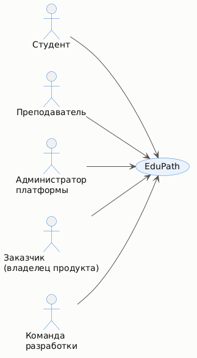
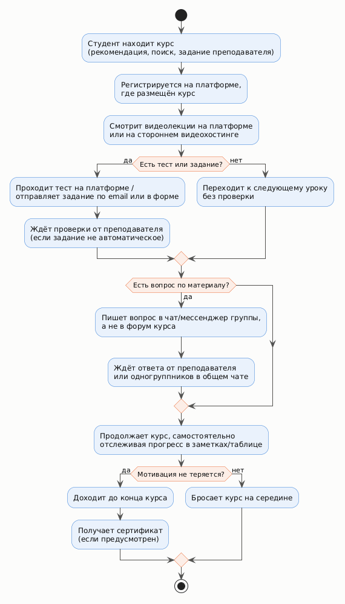
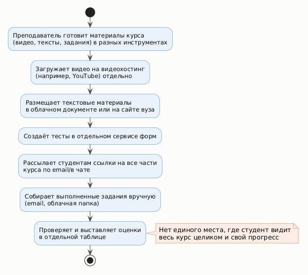

# Стратегия дизайна и бизнес-процессы

## 1. Стратегия дизайна

### Заинтересованные стороны
- Студенты/учащиеся (группы «Самомотивированные учащиеся» и «Студенты по учебной программе»).
- Преподаватели/авторы курсов.
- Администраторы платформы (модерация, качество каталога).
- Учебные заведения/компании, чьи курсы или сотрудники используют платформу (в учебном контексте — курирующая кафедра).
- Команда разработки (студенческая команда, курс ПЧМИ).

### Видение продукта заинтересованными лицами
Студенты хотят учиться удобно и без потери мотивации; преподаватели — публиковать курсы и проверять работы без лишней рутины; администраторы — поддерживать порядок и качество каталога; заказчик — рост доли завершённых курсов и полезные метрики использования.

### Конфликты и противоречия
- Студенты по учебной программе хотят минимум формальностей и простой интерфейс, тогда как платформа заинтересована в развитой системе мотивации (прогресс, значки, сертификаты), которая для этой группы может восприниматься как лишнее давление, а не помощь — компромисс: сделать мотивационные элементы ненавязчивыми и отключаемыми.
- Преподаватели заинтересованы в подробной статистике по каждому студенту, что может конфликтовать с требованиями к минимизации сбора персональных данных об активности пользователей.
- Скорость массовой проверки заданий преподавателем важнее визуальной насыщенности интерфейса — противоречит желанию сделать интерфейс «современным» и ярким.
- Гостевой доступ (просмотр каталога без регистрации) важен для привлечения новых пользователей, но противоречит желанию администратора видеть, кто и как использует платформу, ещё до регистрации.

### Задачи бизнеса, маркетинга и брендинга
- Бизнес-задача: увеличить долю студентов, завершающих начатые курсы (снизить отток).
- Маркетинг: закрепить платформу как удобную альтернативу разрозненным инструментам (видео отдельно, тесты отдельно, чат отдельно).
- Брендинг: единый узнаваемый стиль веб- и мобильного приложения, доверие через понятные сертификаты и прозрачные критерии оценки.

### Измеримые критерии успешности
- Доля студентов, завершивших начатый курс (completion rate).
- Среднее время между регистрацией и первым пройденным уроком (скорость вовлечения).
- Среднее время проверки преподавателем одной присланной работы.
- Доля пользователей, вернувшихся к обучению после push-напоминания.
- Количество выданных сертификатов за период.

### Технические возможности и ограничения
- Веб-приложение и мобильное приложение (Android/iOS) как отдельные репозитории, общий backend/API.
- Хранение и стриминг видеоматериалов с адаптивным битрейтом; поддержка офлайн-скачивания в мобильном приложении.
- Автоматическая проверка тестов и ручная проверка письменных заданий преподавателем.
- Ограничение: прототип в рамках курса не подключается к реальному видеохостингу и реальному каталогу курсов — используются тестовые данные.

### Представления заинтересованных лиц о пользователях (целевая аудитория)
Первоначально аудитория воспринимается как единая «студенты», но исследование (раздел [04-profiles.md](04-profiles.md)) показывает необходимость явно разделять как минимум «самомотивированных» и «обязанных программой» студентов — у них противоположные требования к системе напоминаний и дедлайнов, что влияет на интерфейс.

### Бюджет и график проекта
Учебный проект без реального бюджета. График соответствует календарному плану лабораторных работ курса ПЧМИ (8 лабораторных работ за семестр): ЛР1 — исследование (сентябрь-октябрь 2026), ЛР2-3 — прототипирование интерфейса, ЛР4-6 — разработка веб/мобильного приложения и API, ЛР7-8 — тестирование и оценка UX, финальная сдача — по графику деканата ФПМИ БГУ.

## 2. Диаграммы бизнес-процессов (As-Is)

Процессы описаны **как они происходят сейчас, без разрабатываемой единой платформы** (текущая практика разрозненного онлайн-обучения: видео на одной платформе, тесты — отдельно, общение — в мессенджерах).

### Процесс 1. Прохождение студентом онлайн-курса (As-Is)

**Проблемы процесса:** прогресс и дедлайны студент вынужден отслеживать вручную (заметки/таблицы), общение по вопросам идёт в сторонних чатах и теряется, нет единого места для материалов, тестов и обсуждения — что подтверждает актуальность выбранной темы.

### Процесс 2. Публикация нового курса преподавателем (As-Is)

**Проблемы процесса:** материалы курса разбросаны по нескольким сервисам, у преподавателя нет единой статистики по студентам, сбор и проверка заданий требуют ручной сортировки вложений из почты.
